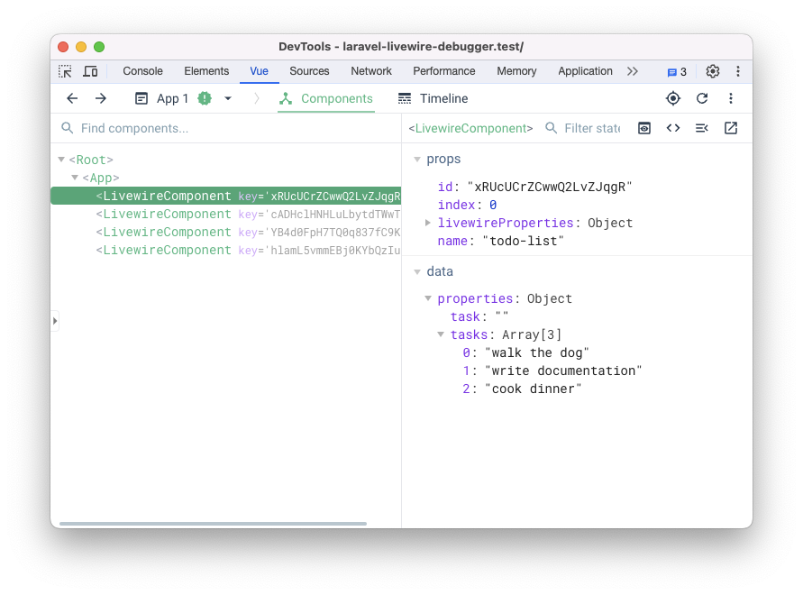

# Laravel Livewire Debugger

Very simple extension that helps debugging Livewire components from Vuejs devtools.

1. Clone the following repository
2. Run `npm install` from the root folder
3. Run `npm run dev`
4. Go to `chrome://extensions` in your browser
5. Double check if Developer mode is ON, if not you need to toggle from the top-right corner
6. Click the **Load Unpacked**
7. Select the `dist` directory

> This extension requires VueJs devtools. You can get it from [here](https://chromewebstore.google.com/detail/vuejs-devtools/nhdogjmejiglipccpnnnanhbledajbpd)

8. Open the VueJs devtools
9. 🎉 you should be able to see all your components listed.